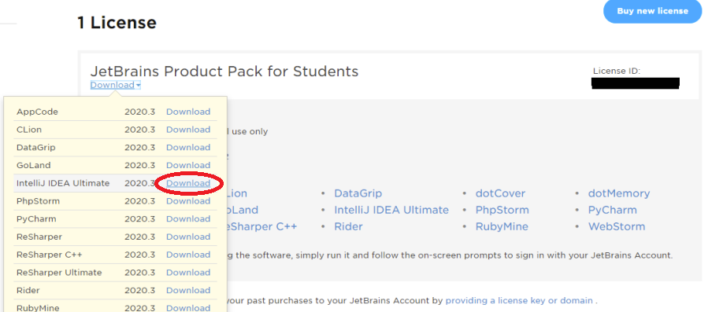

# Playalong
## DAT109 Project

### Lenker

* [Utviklingsplan](Project/Documents/utviklingsplan.md)
* [Ordliste](#)

#### Overview
Our group has opted to tackle Task 2 as our project.

#### Meeting references:
[Referat 9. Mars](/Project/Referat/Referat_1_(9._mars).pdf)

#### Useful info:
* Logging time:
    * Create name.csv under [Project/Workhours]()
    * open with vscode/notepad++/whatever
    * Create header
        * `Date;Hours;Description`
    * Log time:
        * `21/3/9;2;Project meeting`

### Project Setup:
* Install GitHub Desktop:
    * [Github Desktop](https://desktop.github.com)
    * Login with School user (or private if so prefered)
    * Download repository
* Create JetBrains student license:
    * [Educational License](https://www.jetbrains.com/community/education/#students) (use school email)
    * Confirm email
    * Log in (https://account.jetbrains.com/login), and download as shown in the picture:
    * 
    * Install the environment and lunch it.
    * It will request another log in, use the licensed account.
* Install TomEE:
    * [TomEE](https://tomee.apache.org)
    * Unzip into: 
        * Mac: [/Library/TomEE](/Library/TomEE)
            * In terminal type `chmod -r 777 /Library/TomEE`
        * Windows: [C:/ProgramFiles/TomEE](C:/ProgramFiles/TomEE)
            * (Nothing in the way so long..)
* Install IntelliJ IDEA:
    * [IDEA](https://www.jetbrains.com/idea/)
    * Open project (where you downloaded repository, Playalong.iml and pom.xml should be inside opened project)
* Setup TomEE in IntelliJ:
    * (Preferences/Settings) -> Build, Execution, Deployment -> Application Servers ->
    * (+) -> TomEE Server, Set TomEE Home to installation path

#### GIT Team Etiquette:

[git-etiquette](https://dev.to/milu_franz/git-explained-proper-team-etiquette-1od)

Since we are 11 people working on this project, some precautions have to be taken as not to step on eachothers toes, thus sticking to common etiquette is a good practice.

###### Summary
* The main and test repositories represents **finished** code
* **Do not push/publish to main/test, even though these are locked**

#### Collaborators:
* Aahed Diyab
    * 588408
* Abu Tallaha Hussain
    * 586615
* Daniel Kleiven Haugland
    * 581303
* Emilie Hinna Fisketjøn
    * 585005
* Ivar Kvalsund Gjuvsland
    * 584996
* Mathias Nupen
    * 584967
* Olav Pete
    * 588249
* Sebastian Misje Jonassen
    * 584981
* Thomas Hammer
    * 584962
* Thorbjørn Svendal
    * 586636
* Øyvind Espetvedt
    * 584986

#### Roles 

##### Back end 
* Aahed 
* Thomas 
* Sebastian 

##### Front end 
* Daniel
* Øyvind 
* Mathias 

##### Fullstack/potato 
* Olav 

##### Testing 
* Tallah 
* Thorbjørn 

##### Project-leaders 
* Ivar 
* Emilie 